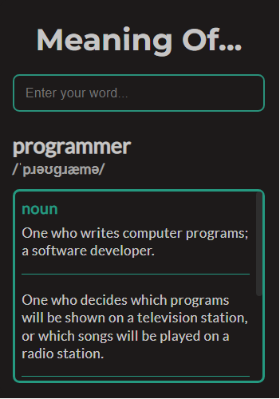
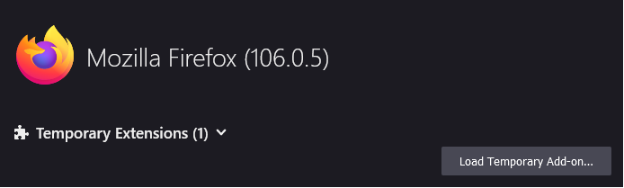
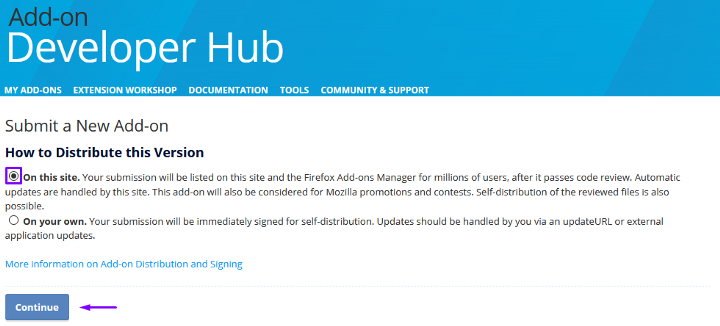
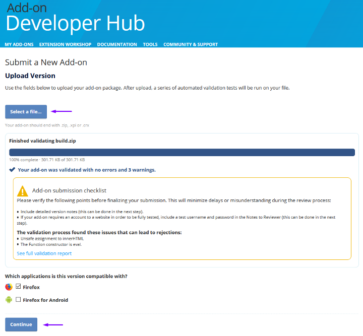
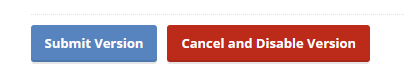

<p align="center">
  <a href="https://addons.mozilla.org/en-US/firefox/addon/meaning-of/">
    
  </a>

  <h1 align="center">Meaning Of...</h1>
</p>

An extension that helps you find the definitions of a word.

_(Click on the icon to navigate to the extension)_

---

Following is the screenshot of the extension

-   

---

# Want to publish your creative extensions on Mozilla AddOns ?

Following are the steps to publish your extensions:

-   Firstly, your project must include a manifest.json file. Without it, you cannot create any extensions.

```
{
    "name": (EXTENSIONS_NAME),
    "description": (DESCRIBE WHAT YOUR EXTENSION PERFORMS),
    "version": (PERSONAL PREFERENCE),
    "manifest_version": 2 (CURRENTLY, MOZILLA USES MANIFEST VERSION 2),
    "browser_action": {
        "default_popup": (ROOT HTML FILE),
        "default_title": (SAME AS IN name),
        "default_icon": {
            "48": (ICON SIZE: 48x48 IN PNG),
            "96": (ICON SIZE: 96x96 IN PNG)
        }
    },
    "icons": [
        {
            (SAME AS IN default_icon)
        }
    ]
}
```

-   Then, create your project as usual. Be creative!!

-   After finishing your project, create a build folder. To create a build folder, you need to use third-party bundlers like webpack or parcel.

-   Then, test your extension first by typing _"about:debugging"_ in the Firefox URL bar. Then, go to _This Firefox_ which provides information about the extensions and running workers.

-   Click on _Load Temporary Add-on…_ which should open a file picker. Navigate to the build folder of the extension, select the index.html and press _Open_.



-   Navigate to [Add-on Developer Hub](https://addons.mozilla.org/en-US/developers) and click on _Submit or manage extensions_. You will be asked to sign in. If you're already signed in, simply click on _Submit a new Add-on_.

-   After that, we’re asked to decide how we’re going to distribute the extension either on our own or on the Firefox Add-ons Manager.



-   Next, we’re finally asked to upload the extension. But before we can do that we have to compress all of the contents of the build folder into a ZIP file. After that, we can click on Select a file… and open the freshly compressed file.



-   In the next step, we’re asked to review the source code submission policy and attach the source code if needed. Since we’ve developed an extension in React and React does minify and generate some additional code we also have to compress and upload the source code.
    Don’t forget to include instructions on how to build your extension in the README.md file to avoid unnecessary rejections.

-   Lastly, we have to describe the extension we’ve just uploaded. Some information will already be prefilled from manifest.json we created earlier. After filling in all of the required fields, we’re finally ready to submit the extension by clicking on the _Submit version_.


